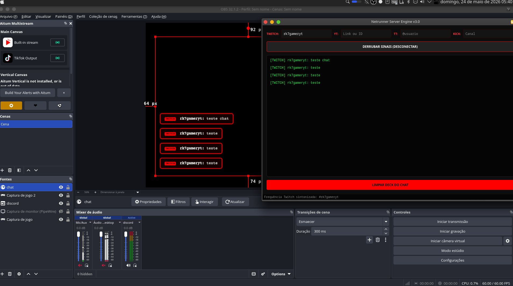
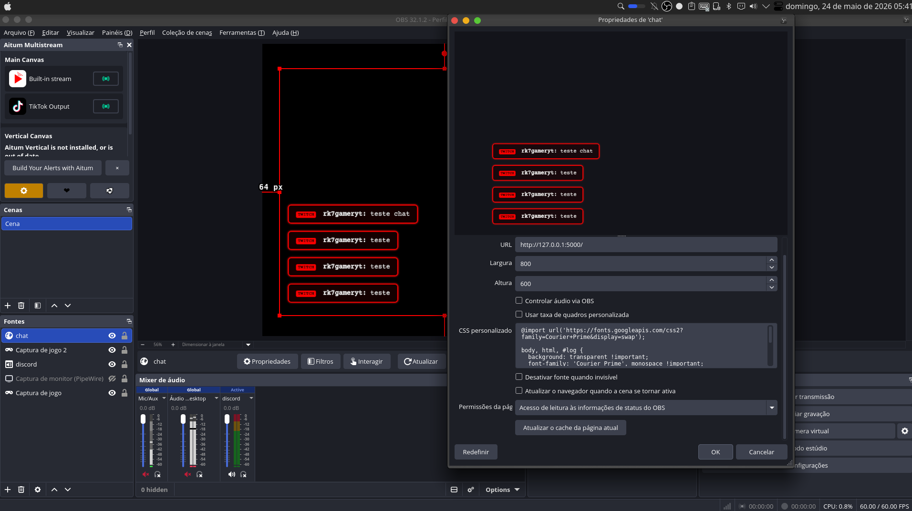

🍷Netrunner Stream Engine

Multi-platform live chat engine for OBS with fully customizable overlays.

Netrunner Stream Engine was created to provide a customizable alternative for stream chat aggregation tools. It captures live chat messages from multiple platforms and serves them locally for use with OBS Browser Sources.

Supported platforms:

* ✅ Twitch
* ✅ YouTube
* ✅ TikTok
* ✅ Kick

---

## Features

* Multi-platform live chat aggregation
* Local Flask server for OBS integration
* Fully customizable HTML/CSS overlay
* Standalone Linux AppImage
* Real-time message updates
* Cyber-themed interface
* Lightweight local execution

---

## Installation

### Linux AppImage (Recommended)

Download the latest AppImage from:

Releases → Latest Version

Make executable:

```bash
chmod +x NetrunnerStreamEngine-v3.0-x86_64.AppImage
```

Run:

```bash
./NetrunnerStreamEngine-v3.0-x86_64.AppImage
```

---

## Using with OBS

1. Open Netrunner Stream Engine

2. Fill the platforms you want:

* Twitch channel
* YouTube stream URL/ID
* TikTok username
* Kick channel

3. Click:

```text
ENGATAR CAPTURA DAS REDES
```

4. Open OBS

5. Add:

```text
Source → Browser
```

6. Use:

```text
http://127.0.0.1:5000
```

Recommended settings:

Width:

```text
800
```

Height:

```text
600
```

---

## Screenshots

Main Window:



OBS Integration:



---

## Project Structure

```text
NetrunnerStreamEngine/
├── netrunner_server.py
├── README.md
├── assets/
├── dist/
├── build/
└── AppDir/
```

---

## Built With

* Python
* PyQt6
* Flask
* TikTokLive
* pytchat
* pysher
* PyInstaller
* AppImage

---

## Roadmap

* [ ] Theme system
* [ ] CSS profile loader
* [ ] Chat animations
* [ ] Donations and subscriptions events
* [ ] Text-to-Speech
* [ ] Plugin support
* [ ] Windows version
* [ ] Custom event triggers

---

## Contributing

Suggestions, issues and pull requests are welcome.

---

## License

MIT License

---

## Author

Copyright (c) 2026 Rk7gamerYT

Built because stream chat customization deserved more freedom.
